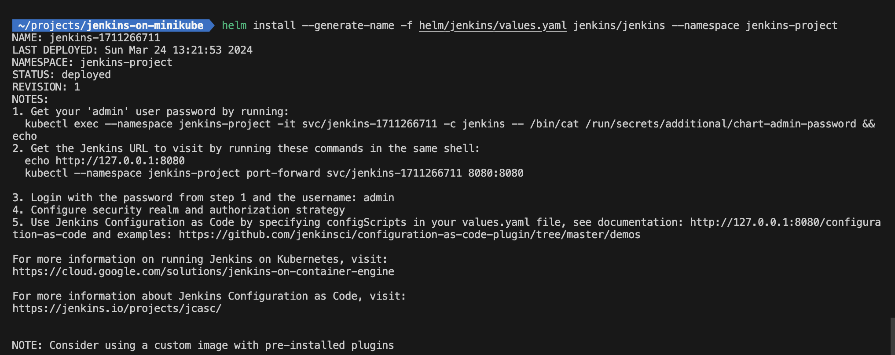
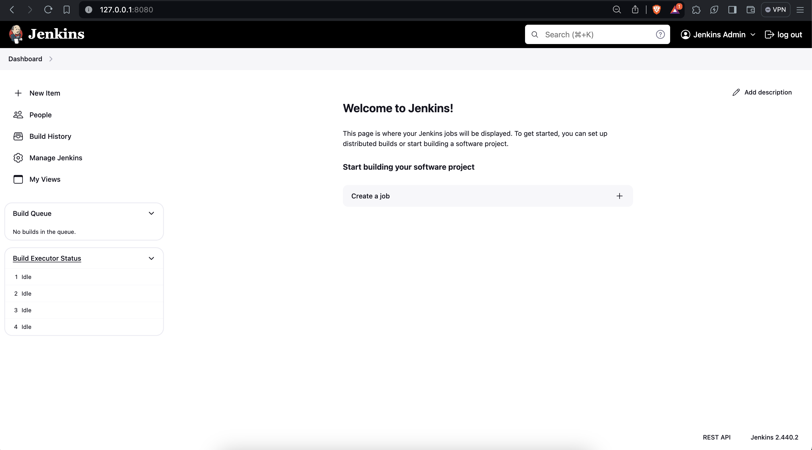

# POC on how to install Jenkins on minikube cluster

Pre-requisities:

kubectl - `brew install kubectl`

kubernetes-helm - `brew install kubernetes-helm`

1. Start your Minikube server and get the dashboard up and running

`minikube start`

`minikube dashboard`

2. Once the minikube is up and running, create the following namespace and persisent volume under minikube folder:

`kubectl create -f namespace.yaml`

`kubectl create -f pv-volume.yaml`

Then, check if the namespace and PV is created successfully:

`kubectl get ns -A` and `kubectl get pv -A`

### Install Helm chart for Jenkins

1. Go to helm folder and run the following command so that Helm installs Jenkins chart

`helm repo add jenkins https://charts.jenkins.io` - Installs the chart

`helm repo update` - Updates the Helm chart repositories

`helm repo ls` - Retrieves the list of Helm repos

2. Once after the chart is installed, now we have install Jenkins application into the Minikube cluster

`helm install --generate-name -f helm/jenkins/values.yaml jenkins/jenkins --namespace jenkins-project`

Helm generates a unique name for Jenkins pod if not specified. Here we also specify:
- filename
- chart name
- namespace

Once upon the successful deployment of Jenkins, we get the below output:

You can see the status says `deployed` along with other useful information. Alternatively, you can do `kubectl get pods -A` to get the list of pods

Follow the steps to retrieve admin password and also perform port-forwarding to access Jenkins dashboard like below

`kubectl --namespace jenkins-project port-forward svc/jenkins-1711266711 8080:8080`

Now you can create pipeline jobs, add agents and many more stuff! :zap: :tada:
